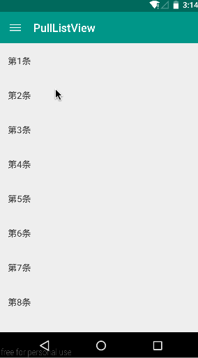
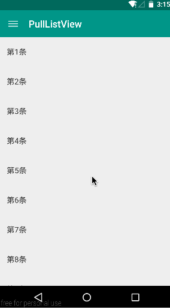
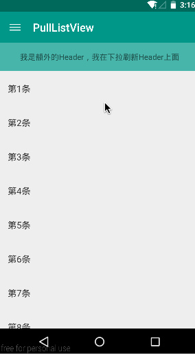
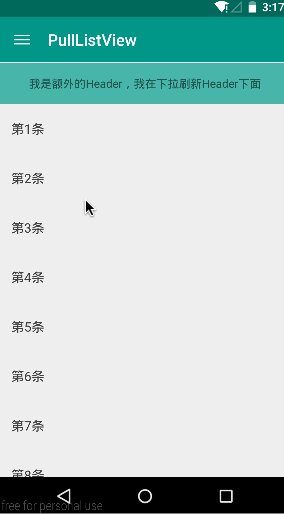

#PullListView
###一个简单的下拉刷新和加载更多的ListView 


#例子
###下拉刷新，自动加载更多  


###点击加载更多  
  

####添加额外Header1  



###添加额外Header2  


#配置
###getMoreType
可选属性```auto```，```click```，默认为```auto```  
加载更多触发方式，默认为滑动到底部自动加载更多  
###addPullHeaderByUser
boolean值，默认为```false```  
自定义属性，是否由用户自己控制添加下拉刷新Header  
默认为false，下拉刷新Header会在构造函数中添加到PullListView中，作为第一个Header，显示在最上部  
如果用户添加了额外的Header，额外的Header会在下拉刷新Header之下。  
用户有时需要控制添加Header的顺序,可以将此属性设置为true，并在合适的时机，主动调用addPullHeader()方法，去添加下拉刷新Header


#License
GPL V2


